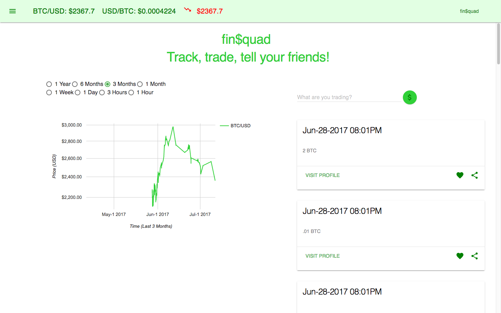

# Coin Tracker

Coin Tracker is a web based application that tracks the price of various cryptocurrency (currently Bitcoin) in real time by storing the price of various cryptocurrency into a database along with a timestamp. The data is then rendered into a graph that updates in real time. This is a work in progress



## Getting Started

To get started you need to run Coin Tracker on your localhost. Please open up your terminal. Make sure node is installed. In your terminal, navigate to the the main folder in the application and run "node server.js".
Once your server is successfully running, navigate to "localhost:8080" in your browser.

### Prerequisites

What things you need to install the software and how to install them

```
node
MySQL
```

## Built With

* [Handlebars](http://handlebarsjs.com/) - The web framework used
* [MySQL](https://www.mysql.com/) - The database framework used
* [Google Material Chart](https://developers.google.com/chart/) - JavaScript library used for creating the chart
* [Material Design Lite](https://getmdl.io/) - CSS framework
* [CryptoCompare](https://www.cryptocompare.com/api) - API used for gathering the current price of BitCoin


## Authors

* **Randall "Lamb" Lunetto** - [LunettoRandall](https://github.com/LunettoRandall)
* **Sean Esteva** - [seangeleno](https://github.com/seangeleno)

See also the list of [contributors](https://github.com/Capitol-Hill/Capitol-Hill/graphs/contributors) who participated in this project.